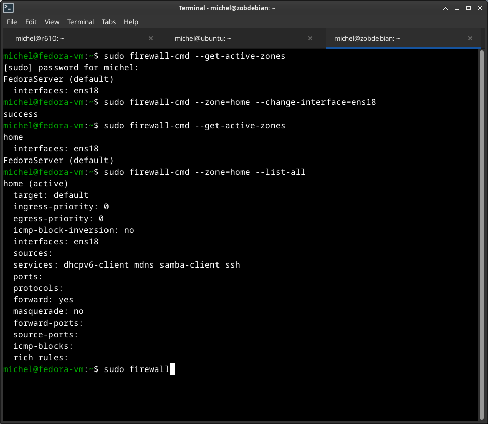
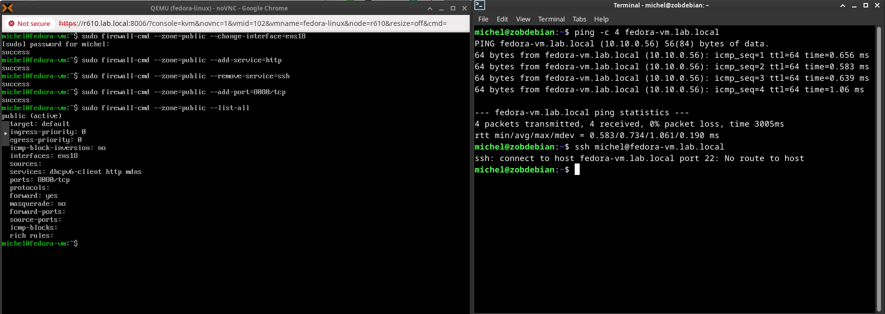
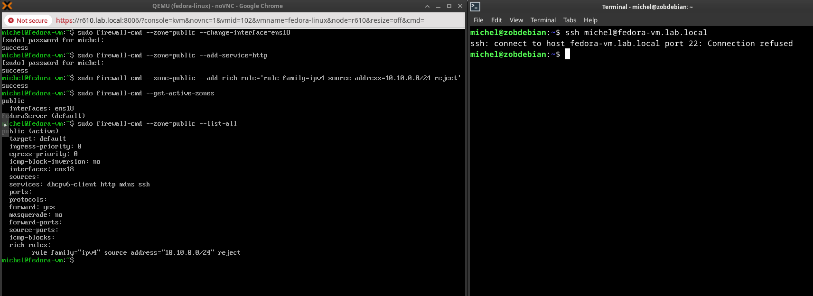

# Firewalld
Author: **Michel Zogbelemou**  
Mentor: **ChatGPT — Elite DevOps Career Mentor**

## Objectives

- Understand firewalld's architecture
- Apply zone-based filtering
- allow/deny services and ports, and observe how clients experience rejections.
- validate that ssh, http, and custom ports behave correctly aftre rule modification.

## Firewalld core concept
firewalld is a dynamic firewall manager built on top of **nftables**. It architectures revolves around:

### 1. Zones

Zones represent trust levels, each containing:
- allowed services
- open ports
- forward/masquerad rules
- ICMP filters
- rich rules

### 2. Runtime vs permanent Configuration
- **Runtime:** Immediate effect, lost on reboot.
- **Permanent:** Written to `/etc/firewalld/` and requires `--reload`.

### 3. Services

A logical grouping of ports & protocols stored in:
`/usr/lib/firewalld/services/*.xml

Exemple
- `ssh` --> port 22/tcp
- `http` --> port 80/tcp

### 4. Rich Rules
Granular nftables-style logic:
- source/ destination
- ports
- protocols
- accept / drop / reject
- logging 
- masquerading

Example:
```bash
rule family=ipv4 source address=10.10.0.0/24 reject
```

### Masquerading

outbound NAT for private networks- essential for container nodes, k3s, or internal-only services.
## LAB 1
Check which interface is assigned to which zone.

Reassign your main interface to the home zone.

Compare policies between public and home.

Goal: Understand risk levels of each zone.



## Lab 2
In public zone:

Allow HTTP

Open port 8080/tcp

Remove SSH access



### Lab 3:

