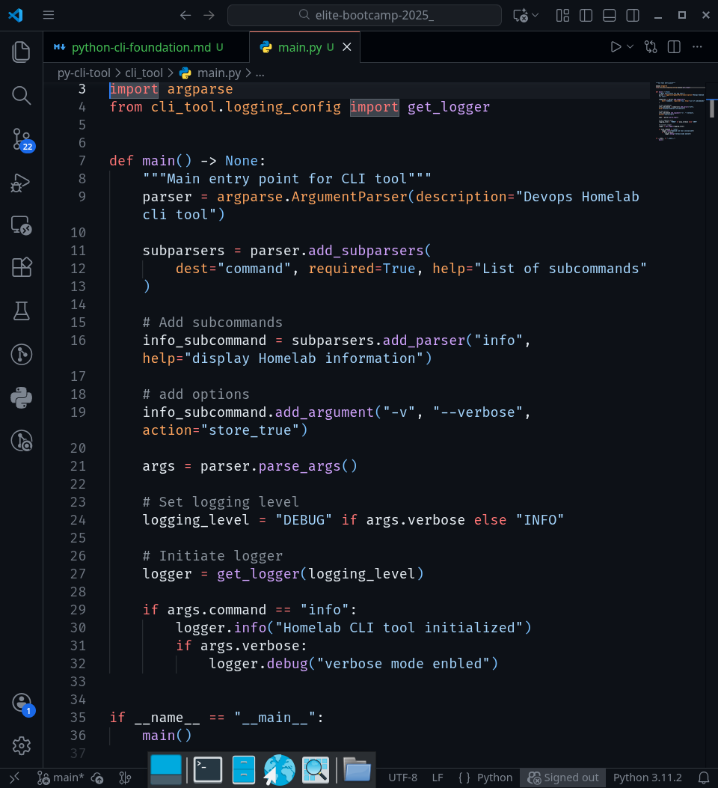
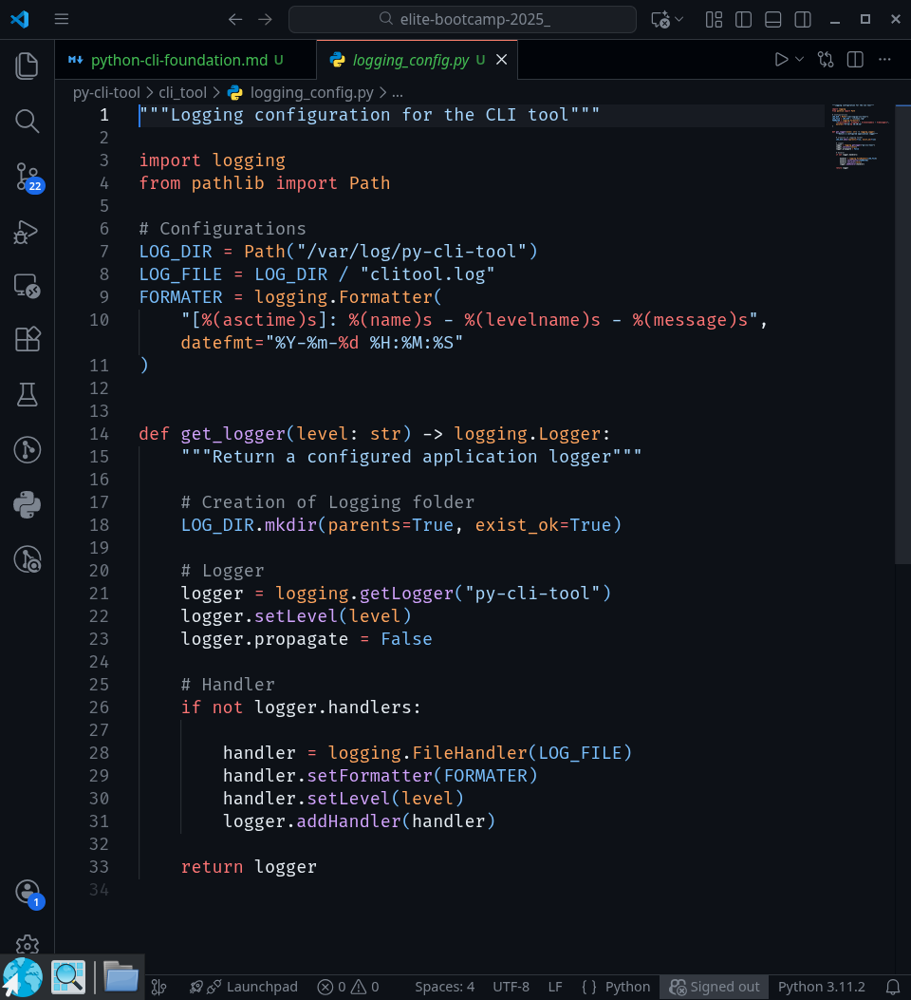

# Python CLI Tool Foundation

**Author: Michel Zogbelemou**  
**Mentor: ChatGPT — Elite DevOps Career Mentor**

---

## Objectives

- Build a production-ready Python CLI project structure.
- Implement a basic CLI using `argparse`
- Configure safe, idempotent logging with file handlers.
- Prepare the foundation for YAML parsing, pytest, and CI/CD in later days.

---

## Concepts Covered:

### 1. Python CLI Design for DevOps
DevOps automation frequently relies on small, composable CLI tools rather than monolithic applications. APyton well-design CLI:
- Accepts arguments and subcommands
- Produces structured logs
- Can be executed locally, in CI pipelines, and inside containers

### 2. argparse
`argparse` is the standard Python library for building CLIs.
In this lab, it is used to:
- Define subcommands
- Attach flags (`--verbose`)
- Validate required input

### 3. Logging for Automation
Production automation must log:
- What happened
- When it happened
- At what severity level

key logging principales applied:
- single application logger
- No duplicated handlers
- File-based logging
- Verbosity controlled by CLI flags

### 4. pathlib
`pathlib` provides a safe, cross-platform way to manage filesystem paths, which is critical for Linux + Windows automation later in the roadmap

---

## Project Structure

```text
py-cli-tool/
├── cli_tool/
│ ├── init.py
│ ├── main.py
│ └── logging_config.py
├── tests/
│ └── test_placeholder.py
└── README.md
```
This structure supports:
- clean imports
- pytest discovery
- Future packaging (`pyproject.toml)
- CI/CD execution

---

## Labs Performed

### Lab 1 - Project Skeleton
Created a dedicated Python package for the CLI tool with a clear separtion between:
- Entry point logic
- Logging configurationPytonPyton

## Lab 2 - CLI Implementation
Implemented a basic CLI with:
- one subcommand: `info`
- one flag: `--verbose`
- Argument validdation via `argparse`


### Lab 3 - Logging Configuration
Configured logging with:
- Application-level logger
- File handler writng to `/var/log/py-cli-tool/clitool.log`
- formatter with timestamps and log levels
- Protection against duplicate handlers


